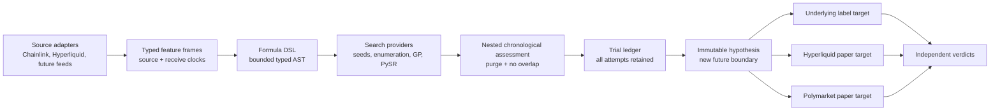

# Alchemy Formula Lab — venue-neutral fixed-horizon proof of concept

## Decision

Build Formula Lab as Alchemy-wide hypothesis infrastructure, not as a Polymarket feature and not as
a strategy factory. Market feeds and economic destinations are adapters around a venue-neutral
formula engine.

The first proof of concept asks one narrow question:

> At time \(t\), does a bounded algebraic expression over causal Chainlink and Hyperliquid
> features predict a negative underlying return at exactly \(t + 10\) minutes?

The label is:

\[
r^{short}_{t,10m}
= 10{,}000 \log \left(\frac{P_t}{P_{t+10m}}\right)
- c_{roundtrip}
\]

where \(c_{roundtrip}\) is supplied by the experiment. This is an underlying-return screening
label, not executable venue P&L.

If a formula later survives an untouched forward test, each venue translation is a separate
experiment:

1. The underlying target scores the frozen expression against the exact ten-minute price label.
2. A Hyperliquid paper target may enter a short perpetual and close it exactly ten minutes later,
   including executable spread, fees, slippage, funding, and unavailable fills.
3. A Polymarket 15m paper target may map the same direction to buying `DOWN` at the executable ask
   and selling at the executable bid exactly ten minutes later.
4. These targets do not pool scores or share a verdict. Each begins at a new future boundary.

A 5m Polymarket contract cannot host a ten-minute timed exit and is ineligible for that target.

## What has already been done elsewhere

This is a known family of methods:

- Symbolic regression searches for readable equations instead of fitting only opaque weights.
  [PySR](https://ai.damtp.cam.ac.uk/pysr/v2.0.0a2/api) exposes explicit operator, nesting,
  complexity, evaluation-budget, and parsimony controls.
- Genetic programming and newer program-search work apply expression mutation and selection to
  trading rules. Their published returns are not portable evidence for Jester.
- Chronological walk-forward optimization is commonly used for intraday crypto rules. A recent
  [double-out-of-sample study](https://arxiv.org/abs/2602.10785) shows why the final untouched
  period must be evaluated only once.
- [Probability of Backtest Overfitting](https://escholarship.org/uc/item/4w1110bb) and the
  [Deflated Sharpe Ratio](https://papers.ssrn.com/sol3/papers.cfm?abstract_id=2460551) formalize
  the multiple-testing problem. Every generated expression, constant set, threshold, feature
  choice, exit horizon, asset, and retry consumes a trial.

The useful transfer is the machinery. No external formula, threshold, Sharpe ratio, or P&L is
treated as evidence.

## System boundaries

The current POC implements the formula DSL, deterministic trial library, chronological assessment,
a 10,000-variant bounded enumerator, content-addressed datasets, a durable pull-lease research
control plane, a Python worker, capital simulation, and a protected read-only status page. The
research worker receives no database, venue, wallet, or execution credentials. No Formula Lab
router exposes strategy registration or execution.

## Formula representation

Expressions are typed trees, never arbitrary source code and never `eval`.

Features:

- `chainlinkReturn60s`
- `chainlinkReturn300s`
- `hlReturn60s`
- `hlReturn300s`
- `basisBps`
- `basisChange60sBps`
- `basisPersistence5s`

Operators:

- binary: `add`, `sub`, `mul`, `protectedDiv`
- unary: `neg`, `abs`, `tanh`

Limits:

- maximum seven nodes;
- maximum depth three;
- protected division rejects denominators below \(10^{-9}\);
- any non-finite or excessively large intermediate fails closed;
- inputs and formula outputs are normalized using the training fold only.

The deterministic POC library contains eleven seed expressions crossed with three score thresholds,
for 33 declared trials. That small universe proves the evaluator. It is not intended to be the
eventual search budget.

## Chronological assessment

For every outer fold:

1. Sort one asset's observations by causal timestamp.
2. Reserve the next chronological test block.
3. Remove any training label whose ten-minute interval touches that test block.
4. Estimate feature normalization from the remaining training rows.
5. Estimate each formula's output normalization from training rows.
6. Simulate at most one open short per formula; a new entry cannot occur until the prior ten-minute
   label ends.
7. Rank formulas on training data by:

\[
\bar r_{net} - 1.645\,SE(\bar r_{net}) - \lambda \cdot complexity
\]

8. Score only the selected formula on the next test block.
9. Retain the selected identity, train metrics, test metrics, trial count, and timestamps.

Shuffled cross-validation is forbidden. Searching all formulas on every outer test block and then
reporting the best is also forbidden; that would reuse the outer test as training.

## Deeper search path

The deterministic seeds can later be replaced by a bounded search provider:

1. **Enumeration:** generate all canonical expressions under a small node/depth budget.
2. **Genetic programming:** mutate/crossover typed ASTs inside a fixed evaluation budget.
3. **PySR worker:** export a frozen feature matrix to an isolated low-priority job and import its
   Pareto frontier of loss versus complexity.
4. **Neural distillation:** train a black-box model only inside an inner fold, then use symbolic
   regression to distill candidate formulas. The distilled formulas still require outer and forward
   tests.

Every provider writes to the same append-only trial ledger:

- run ID and immutable configuration hash;
- source tape version and exact time bounds;
- formula AST and canonical text;
- threshold and exit horizon;
- feature set and normalization policy;
- complexity and evaluation count;
- inner selection metrics;
- outer chronological metrics;
- source-quality and missingness diagnostics;
- parent/child lineage for mutations;
- whether the formula was exported as a future hypothesis.

No failed or discarded trial may disappear from the denominator.

## Distributed compute contract

The research control plane and workers communicate through `alchemy-research-v2`, a closed,
language-neutral JSON protocol:

1. The API registers one immutable dataset manifest and content-addressed Parquet artifact.
2. An experiment records the complete candidate family, target set, cost model, capital policy,
   evaluator version, and frozen research boundary.
3. The control plane partitions the family into bounded shards and grants short, renewable leases.
4. A worker downloads only hashed artifacts, evaluates its slice, and submits an idempotent
   content-hashed result.
5. Large predictions and trade paths remain content-addressed artifacts; compact candidate rows
   support ranking and inspection.

The dataset partitions discovery and validation by `received_at_ms`. A label is admissible only
when its own receive clock is inside the same research interval. The embargo between intervals is
structural, not a query-time option.

External workers are pull-only and use a dedicated worker secret. They cannot use the application
agent key, connect to Postgres, open a venue connection, read a wallet, register a strategy, or
submit an order.

## Frozen forward validation

Discovery may estimate normalization and rank candidates. Validation may not.

The frozen validation selection contains:

- the exact formula AST, threshold, complexity, and discovery score;
- one mean and standard deviation for every input feature, estimated on discovery rows;
- one mean and standard deviation for each selected formula output, estimated on discovery rows;
- the complete validation family size;
- the untouched future boundary, familywise alpha, and Holm correction declaration;
- a content hash over the entire selection;
- `strategyRegistrationAllowed: false` and `executionAllowed: false`.

Both the TypeScript evaluator and Python worker fail closed if validation calibration is absent,
malformed, tampered, or recomputed. The Python worker filters a combined artifact to the leased
research stage before evaluation. A validation shard must return every frozen family member,
including zero-trade and insufficient-sample rows, so failures cannot disappear from the Holm
denominator.

Holm step-down is applied over the complete candidate × target validation family. A familywise
pass creates only a research-review-eligible result. It does not pass the Polymarket verdict gate,
register a strategy, create a paper bot, or enable execution.

## Adapter contracts

### Source adapters

The engine consumes typed feature frames; it does not fetch a venue. The first source implementation
can materialize the seven features from the existing exact-second `venue_price_snapshot` tape,
which already stores paired Chainlink and Hyperliquid clocks, prices, and basis. The basis
distribution query remains locked until all six pairs pass 100,000 rows, three days, and 500
five-minute blocks.

Every source adapter must:

- use only information received by the formula timestamp;
- require exact prior seconds for short changes and persistence;
- preserve gaps rather than interpolate;
- keep source and receive freshness as eligibility fields;
- materialize the exact ten-minute label only after it exists;
- never make the label available to an online signal path.

### Target adapters

The same frozen directional hypothesis can be tested against different economic targets, but those
results are not interchangeable.

#### Underlying fixed-horizon target

The first target is the exact future underlying return. It isolates forecast mechanics from venue
execution and proves nothing about a tradeable edge.

#### Hyperliquid perpetual paper target

A later adapter must use executable bid/ask and requested depth for both the short entry and exact
ten-minute close. Fees, slippage, funding, rejected or partial fills, and unavailable exits remain
in the result. It requires a new forward boundary and independent verdict.

#### Polymarket economic target

Underlying predictability does not prove a profitable prediction-market trade. A separate adapter
must evaluate:

- entry `DOWN` ask, including taker fee and requested depth;
- exact ten-minute exit `DOWN` bid, including fee and requested depth;
- contract markout versus the underlying label;
- spread and complement error;
- no-book, one-sided-book, stale-book, partial-depth, and post-resolution states;
- a same-tick always-DOWN control;
- asset, clock phase, macro regime, and source-quality segmentation.

The formula is frozen before this economic test begins.

## Exit-time optimization

Ten minutes is fixed in POC v1. If Formula Lab later compares 1m, 3m, 5m, and 10m exits, those are
four distinct hypotheses per formula and threshold—not four free views of one result.

The safe sequence is:

1. freeze the allowed exit grid;
2. count every formula × threshold × exit combination;
3. choose inside inner training folds;
4. score that choice in outer chronological folds;
5. export one immutable formula and exit rule;
6. start a new untouched paper boundary.

This supports discovering an exit policy without pretending its optimization was free.

## Alchemy / Server2 load policy

- Reuse the existing Chainlink/Hyperliquid tape; add no subscription.
- Do not run a live search while the tape is locked.
- Materialize features in one bounded batch after readiness, partitioned by pair.
- Run formula search in a low-priority worker with a wall-clock, candidate-count, memory, and CPU
  budget.
- Cache immutable feature matrices and distribution artifacts by content hash.
- Never run PySR, genetic programming, or a broad expression enumeration in the API process.
- Pause search automatically when normalized host pressure exceeds the existing low-priority work
  threshold.
- Give each source adapter one bounded ingestion path; Formula Lab reuses materialized frames rather
  than multiplying subscriptions per formula or target.

## Current proof

The synthetic test suite demonstrates:

- protected and bounded formula evaluation;
- deterministic accounting of all 33 seed trials;
- recovery of an intentionally planted short formula across chronological folds;
- a full ten-minute purge at each fold boundary;
- no overlapping positions;
- future observations cannot alter the first fold's selected formula;
- exact discovery/validation receive-clock partitioning;
- frozen discovery calibration cannot be recentered on validation rows;
- zero-trade validation candidates remain in the declared family;
- full-family Holm step-down and fail-closed incomplete-family behavior;
- deterministic capital paths under fixed-notional, equity-fraction, fixed-risk, and
  equity-fraction-risk policies;
- cross-language acceptance of Python results by the TypeScript gateway;
- no worker database, venue, paper-ledger, Crucible, signing, or execution dependency.

That proves the mechanics. It does not prove market edge.
